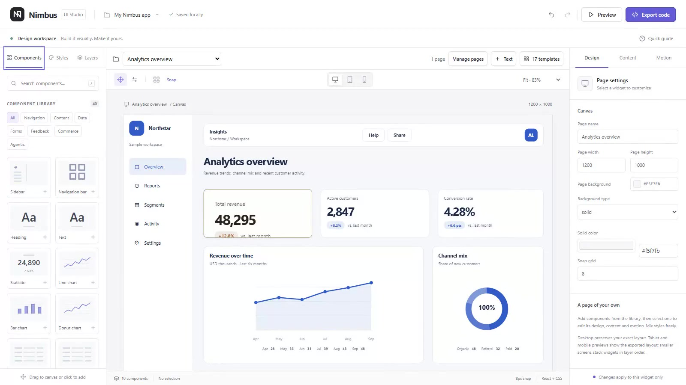

# Nimbus UI Studio Lab

Nimbus is a local-first visual prototype builder for dashboard and agentic-product interfaces. Arrange widgets across linked pages, mix design presets, customize content, backgrounds and motion, then preview full-screen and export a React app package or standalone HTML.

## Watch the Studio demo

[](docs/media/nimbus-studio-demo.mp4)

[Watch or download the MP4](docs/media/nimbus-studio-demo.mp4) — a 57-second recording of the running application, not a mockup (H.264, approximately 1.7 MB). It shows editing widget text and values, browsing the 75-style Token Studio in light and dark, applying a style, exploring the 17 page templates, switching between desktop and mobile preview, and downloading a React ZIP. Recorded at 1600 × 900 on September 6, 2026; silent video.

The recording demonstrates the current editor and existing export runtime. It does not claim that the upcoming native `nimbus-ui` component/export fidelity milestone is complete.

## Run the studio

Requires Node.js 22.16 or newer. From this repository:

```powershell
npm run setup
npm run dev
```

Open http://127.0.0.1:5173. Setup uses the pinned pnpm 12.3.4 through npm and initializes `.nimbus/studio.sqlite`; no global package-manager change, database installation, account or `.env` file is required. Installation requires network access; normal startup uses installed dependencies and a loopback-only local database service. Ctrl+C stops both listeners. See [local development](docs/local-development.md) for backup and troubleshooting.

## Product direction

[GOAL.md](GOAL.md) is the current design/export product specification. Nimbus aims to turn a designer's choices into a deterministic, reviewable component composition that an AI coding agent can extend without inventing another design system. Shorter composition files should reduce repeated markup in model context; **token savings have not yet been measured**, and no numeric cost claim is currently verified.

The existing prototype below is the starting point, not completion of that specification. The local SQLite foundation (M0) is merged. The current M1 branch adds the original token catalog and Token Studio; full widget fidelity, motion runtime, media/library tooling, native `nimbus-ui` exports, project dashboard, and complete project templates have separate exit gates. The older agent-protocol roadmap is outside this release.

## What works

- 40 widget kinds across navigation, content, data, forms, feedback, commerce and agentic UI.
- 75 original descriptive visual styles, each with light/dark semantic color, type, spacing, shape, elevation and motion tokens. Styles → Open Token Studio exposes swatches, measured contrast, CSS and typed token JSON downloads.
- Click or drag to insert, pointer movement and resizing, grid snapping, keyboard nudging, editable dimensions.
- Per-widget fill, accent, text, border, radius, padding, opacity, typography and elevation.
- Content, table/chart data, image and sidebar-logo uploads; uploaded raster images travel inside exports.
- Entrance, hover and press motion, timing controls and five component states.
- Layer ordering, visibility, locking, duplication, deletion, and bounded undo/redo.
- 17 designed page templates plus blank pages, with all 75 visual styles retained.
- Multi-page projects, per-widget and navigation-item page links, project-wide undo/redo.
- Full-window interactive prototype preview, optional native fullscreen, desktop/tablet/mobile views.
- Adaptive editor panels and dialogs follow the visible browser area, including visual zoom; narrow screens expose Components / Canvas / Properties navigation instead of clipping the inspector.
- Solid/gradient/image backgrounds, per-text-role typography, logo sizing and loading animation controls.
- Browser-local IndexedDB autosave, legacy migration, validated JSON import and downloadable editable projects.
- Export app/page/widget React ZIPs with local Nimbus runtime source and uploaded assets; copy component code or standalone HTML.

Read [the studio guide](docs/studio-guide.md) for shortcuts, export behavior and limitations.

## Code boundaries

The existing Vite and Next.js reference applications consume one shared application-shell entry point. Implementation modules live in `packages/application-shell/src/studio`:

| Module | Responsibility |
| --- | --- |
| types, model, history | Versioned project contract, validation, editing helpers and undo/redo |
| catalog, presets | Widget definitions and explicit legacy-renderer style adapter |
| tokens, token-catalog, token-studio | Validated pure token contracts, 75 original light/dark archetypes, scoped swatch sheets and token export |
| render, export | Shared escaped markup/CSS and portable code generation |
| studio, canvas | Editor orchestration, persistence, pointer and keyboard gestures |
| library, inspector, panel-tabs | Insertion, presets, layers and accessible property navigation |
| export-dialog | Focus-managed export, download and clipboard fallback |
| project, project-storage | Multi-page contracts, migration, page operations and ordered IndexedDB persistence |
| pages-panel, prototype-preview, template-gallery | Page management, full-window navigation and 17-template selection |
| package-export, zip, runtime-source | Asset-complete React packages and portable local Nimbus runtime |

## Verification

```powershell
npm run test:studio
npm exec --yes --package=pnpm@12.3.4 --call "pnpm check"
```

Studio tests cover import boundaries, state/history, all preset/widget combinations, renderer states, escaping and a real consumer build of generated TSX. Browser smoke scripts in `tools/studio` run through Playwright CLI and use a disposable browser profile.

Read [the prototype-builder verification record](docs/prototype-builder-verification.md) for test evidence and boundaries. `npm run studio:sync-runtime` refreshes the runtime source shipped in ZIPs after renderer/model/type/export changes; `npm run studio`, the root build, and `pnpm check` perform this automatically.

## Scope and status

This is a usable visual-editor foundation, with unstable public APIs. Business-action widgets are editable UI samples. Authentication, backend data binding, collaboration, tenant isolation, AG-UI transport and A2UI rendering are not implemented by the visual editor. Native fields, checkboxes, details and CSS-only tab interactions work in exported pages; connect business actions in your application.

The editor still saves projects in one browser on one device while the new SQLite repository and HTTP service are being integrated in M3. Database availability is not a claim that canvas autosave already uses SQLite. Download JSON backups. Enterprise deployment and WCAG conformance require separate integration and assistive-technology review.

Token Studio measures supported solid-color pairs, not arbitrary user overrides, image/gradient backgrounds or all component states. Applying a style to the current renderer transfers its supported base fields and preserves uploaded images, logos and per-role text overrides. Existing saved styles remain unchanged until explicitly restyled. Full token-native component rendering and pixel-diff evidence begin in M2. See [preset authoring](docs/preset-authoring.md).

## Design references and license

The reference checkout is kept outside Nimbus at `../nimbus-design-reference` relative to the parent nimbusUI directory. The selectable catalog uses original descriptive archetypes, not company names, logos, proprietary fonts or copied DESIGN.md files. Consulted sources are recorded in [inspiration notes](docs/INSPIRATION.md). Old saved projects retain their explicit visual snapshots; changing catalog labels never silently rewrites a user's design.

Nimbus code is licensed under [Apache 2.0](LICENSE). Adapted reference data retains the complete MIT notice in [THIRD_PARTY_NOTICES.md](THIRD_PARTY_NOTICES.md) and generated code.

## Contributing

Read [CONTRIBUTING.md](CONTRIBUTING.md), [GOVERNANCE.md](GOVERNANCE.md), [SECURITY.md](SECURITY.md) and [repository governance](docs/release/repository-governance.md).

